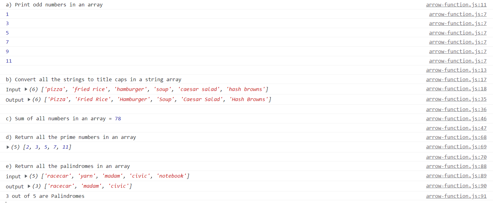

### a) Print odd numbers in an array

```
let arrOddEven = [1,2,3,4,5,6,7,8,9,10,11,12];
let printOddNo = (inputElm) => {
    inputElm.forEach(function(item){
    if(item%2 !== 0){
      console.log(item);
    }
  });
}
console.log("a) Print odd numbers in an array");
printOddNo(arrOddEven)
console.log("");
```

### b) Convert all the strings to title caps in a string array

```
let foods=["pizza", "fried rice", "hamburger", "soup", "caesar salad", "hash browns"]
console.log("b) Convert all the strings to title caps in a string array");
console.log("Input", foods);
let titleCase = (inputArr) => {
    // iterate through input array
    let tempArr = []
    inputArr.forEach(function(item) {
        // split each item to create an array
        let eachItem = item.split(" ");
        let tempWord = '';
        for(let i=0; i<eachItem.length; i++) {
            // convert each sub item to title case and store
            tempWord += ` ${eachItem[i].charAt(0).toUpperCase() + eachItem[i].slice(1)}`
        }
        // push completed word to array
        tempArr.push(tempWord.trim())
    });
    return tempArr;
};
console.log("Output", titleCase(foods));
console.log("");
```

### c) Sum of all numbers in an array

```
let sumofArrays = [1,2,3,4,5,6,7,8,9,10,11,12];

let printSumOfArr = (inputElm) => {
return inputElm.reduce(function(prev, next){
return prev + next;
});
};
console.log("c) Sum of all numbers in an array =", printSumOfArr(sumofArrays));
console.log("");
```

### d) Return all the prime numbers in an array

```
let check4Prime = [1,2,3,4,5,6,7,8,9,10,11,12];

let printPrimeNos = (inputArr) => {

return inputArr.filter(function(inputpoint){

    for (let i = 2; inputpoint > i; i++) {
      if (inputpoint % i == 0) {
        return false;
      }
    }
    return inputpoint > 1;

})

};

console.log("d) Return all the prime numbers in an array");
console.log(printPrimeNos(check4Prime));
console.log("");
```

### e) Return all the palindromes in an array

```
let listPalindrome = ["racecar", "yarn", "madam", "civic", "notebook"]

let checkPalindrome = (listPalindrome) => {
let isPalindrome = []
listPalindrome.forEach(function (params){
let inputWord = params;
let reverseWord = params.split("").reverse().join("");
if(inputWord === reverseWord){
isPalindrome.push(inputWord)
}
})
return isPalindrome;
};

console.log("e) Return all the palindromes in an array");
console.log("input", listPalindrome);
console.log("output", checkPalindrome(listPalindrome));
console.log(`${checkPalindrome(listPalindrome).length} out of ${listPalindrome.length} are Palindromes`);
```

### output:


